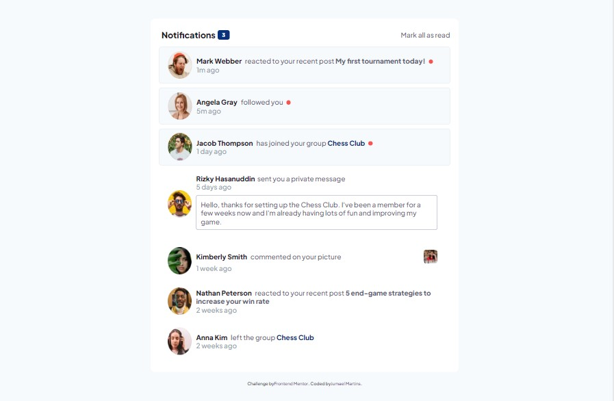

# Frontend Mentor - Notifications Page

Segue solução para o desafio [Notifications page challenge on Frontend Mentor](https://www.frontendmentor.io/challenges/notifications-page-DqK5QAmKbC). Frontend Mentor challenges help you improve your coding skills by building realistic projects.

## Table of contents

- [Overview](#overview)
  - [The challenge](#the-challenge)
  - [Screenshot](#screenshot)
  - [Links](#links)
- [My process](#my-process)
  - [Built with](#built-with)
  - [What I learned](#what-i-learned)
  - [Continued development](#continued-development)
  - [Useful resources](#useful-resources)
- [Author](#author)

## Overview

### The challenge

Usuarios deverão ser capazes de:

- Conseguir diferenciar notificações lidas e não lidas.
- Ter a melhor visualização do conteudo adaptada para cada tipo de tela.
- Efeito visual de hover ao interagir com os elementos com active states.
- Clicar em mark all as read, ter o efeito visual das notificações lidas e o contador setado pra 0.

### Screenshot




### Links

- Solution URL: [https://github.com/jumaelmartins/Frontend-Mentor-Notifications-page](https://github.com/jumaelmartins/Frontend-Mentor-Notifications-page)
- Live Site URL: [https://jumaelmartins.github.io/Frontend-Mentor-Notifications-page/](https://jumaelmartins.github.io/Frontend-Mentor-Notifications-page/)

## My process

### Built with

- Semantic HTML5 markup
- CSS custom properties
- Flexbox
- CSS Grid
- JS Vanila


### What I learned

Conseguir lembrar alguns conceitos basicos de javascript e aplicalos, para poder atualizar as notificações ao click.

```js

const removeUnreadClassByClick = () => {
  unreadNotifications.forEach((item) => {
    item.addEventListener("click", (e) => {
      const notification = item.closest("li");

      if (notification.classList.contains("unread")) {
        notification.classList.remove("unread");
      }
      decrementCounterByClickNotification();
    });
  });
};

const decrementCounterByClickNotification = () => {
  const notificationUnreadCounter = Array.from(unreadNotifications).filter(
    (item) => {
      return item.classList.contains("unread");
    }
  );

  let count = notificationUnreadCounter.length;

  noticationsCounter.innerHTML = count;
  console.log(notificationUnreadCounter);
};

```


### Useful resources

- [Documentacao](https://developer.mozilla.org/pt-BR/docs/Web/API/EventTarget/addEventListener) - Documentação site MDN JS addEventListener.
- [Documentacao](https://developer.mozilla.org/pt-BR/docs/Web/JavaScript/Reference/Global_Objects/Array/forEach) - Documentação site MDN JS forEach.
- [Documentacao](https://developer.mozilla.org/pt-BR/docs/Web/API/Element/classList) - Documentação site MDN JS classList.
- [ChatGPT](https://chat.openai.com/chat) - É uma ferramenta excellente tem me ajudado bastante a tirar duvidas.

## Author

- Portifolio - [Portifolio_JumaelMartins](https://portfolio-jumaelmartins.vercel.app/)
- Linkedin - [@jumael-martins](https://www.linkedin.com/in/jumael-martins/)
- GitHub - [@jumaelmartins](https://github.com/jumaelmartins)
- Frontend Mentor - [@jumaelmartins](https://www.frontendmentor.io/profile/jumaelmartins)

